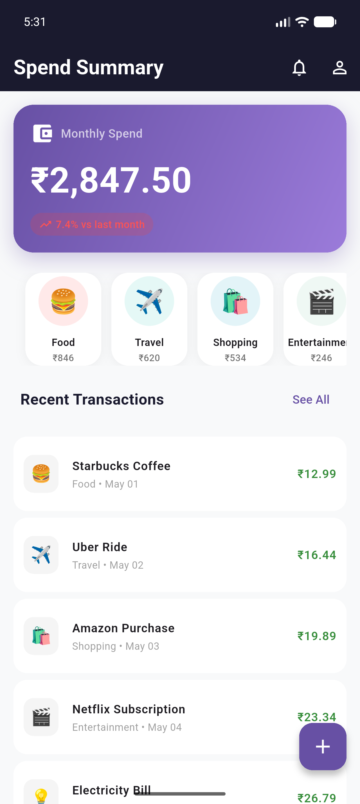
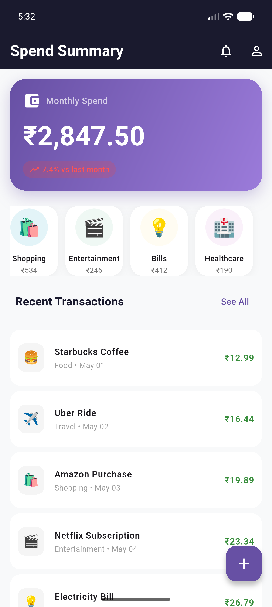
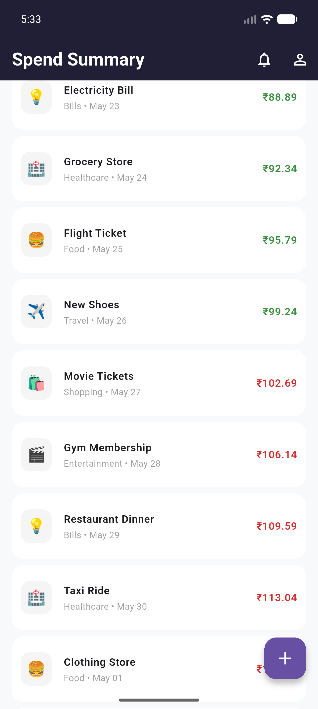

# 💰 Spend Summary - Flutter Expense Tracker

A modern, beautifully designed expense tracking application built with Flutter that helps users visualize their monthly spending patterns.

## 📸 Screenshots

| Home Screen                               | Category Scroll                                     | Transactions List                                         |
|-------------------------------------------|-----------------------------------------------------|-----------------------------------------------------------|
|  |  |  |


> **Note:** Please refer to the `screenshots` folder for all screen captures.

## 📱 About The App

Spend Summary is a comprehensive expense tracking solution that provides users with a clear overview of their financial habits. The app features an intuitive dashboard showing monthly spend analysis, category-wise breakdown, and detailed transaction history - all in one place.

## ✨ Features

- **Monthly Spend Dashboard**
  - Total monthly expenditure with visual indicators
  - Percentage change comparison with previous month
  - Trend analysis (up/down with color coding)

- **Category-wise Spending**
  - Horizontal scrollable categories including Food, Travel, Shopping, Entertainment, Bills, Healthcare
  - Visual representation with custom icons and color coding
  - Category-specific spending amounts

- **Recent Transactions**
  - List of 57 mock transactions for demonstration
  - Transaction details including amount, category, and date
  - Color-coded amounts (red for high-value, green for low-value expenses)
  - Pull-to-refresh functionality

- **Interactive Elements**
  - Floating Action Button for adding new expenses
  - Pull-to-refresh for data reload
  - Smooth animations and transitions

## 🛠️ Built With

- **Flutter** - UI Toolkit
- **Dart** - Programming Language
- **Material Design 3** - Design System
- **intl** - Internationalization and formatting

## 🚀 Getting Started

### Prerequisites

- Flutter SDK (>=3.0.0)
- Dart SDK (>=3.0.0)
- Android Studio / VS Code
- iOS Simulator / Android Emulator

### Installation

1. **Clone the repository**
   ```bash
   git clone https://github.com/SrushtiDasiri/Spend_Summary.git
   cd Spend_Summary